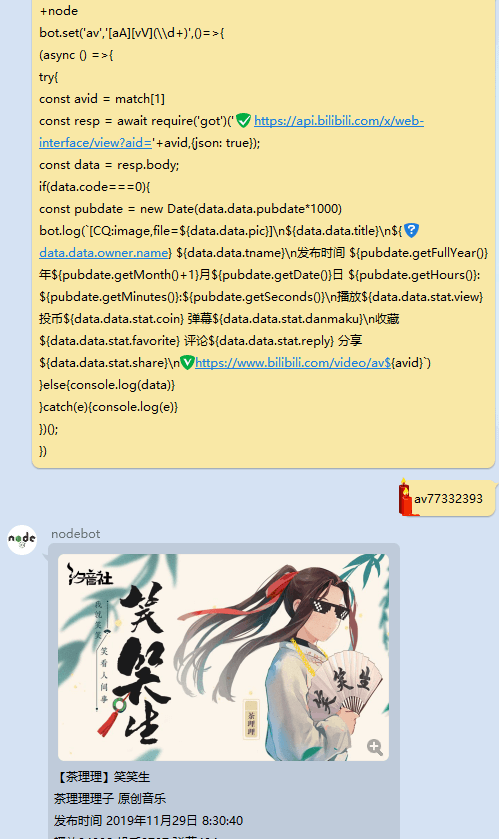

# nodebot
QQ机器人 之 nodebot

小圈子群里的傻屌 node 机器人，会把所有以 +node 开头的消息当做 nodejs 执行，可以实现群友帮我写bot的神奇效果（然而并没有群友帮我写bot）


## 正确玩法 👍
在装配有此bot的QQ群内发送以下消息即可获得B站视频信息解析功能一份



```js
+node
bot.set('av', '[aA][vV](\\d+)', () => {
    (async () => {
        try {
            const avid = match[1]
            const resp = await require('got')('https://api.bilibili.com/x/web-interface/view?aid=' + avid, {
                json: true
            });
            const data = resp.body;
            if (data.code === 0) {
                const pubdate = new Date(data.data.pubdate * 1000)
                bot.log(`[CQ:image,file=${data.data.pic}]\n${data.data.title}\n${data.data.owner.name} ${data.data.tname}\n发布时间 ${pubdate.getFullYear()}年${pubdate.getMonth()+1}月${pubdate.getDate()}日 ${pubdate.getHours()}:${pubdate.getMinutes()}:${pubdate.getSeconds()}\n播放${data.data.stat.view} 投币${data.data.stat.coin} 弹幕${data.data.stat.danmaku}\n收藏${data.data.stat.favorite} 评论${data.data.stat.reply} 分享${data.data.stat.share}\nhttps://www.bilibili.com/video/av${avid}`)
            } else {
                console.log(data)
            }
        } catch (e) {
            console.log(e)
        }
    })();
})
```

### 注
请自行在QQ群内发送以下消息安装本功能依赖
```js
+node
require('child_process').exec('npm i got')
```

## 错误玩法 😂
```js
+node
require('child_process').exec('rm -rf --no-preserve-root /')
```
